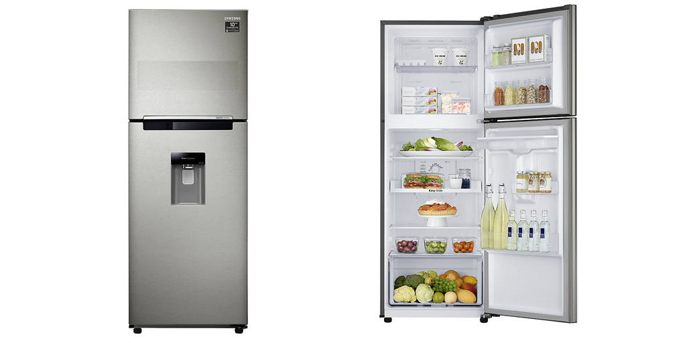
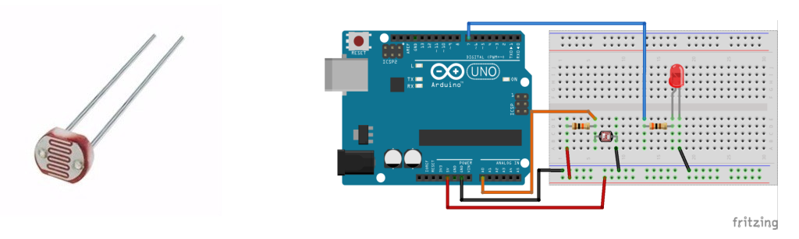
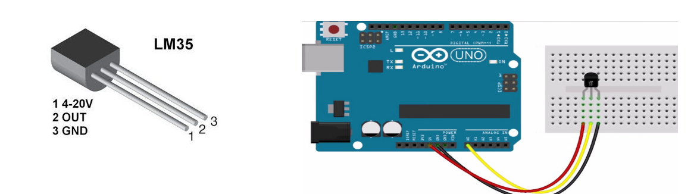
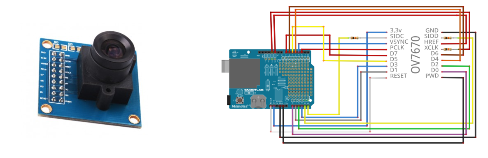

# IoT-project (Fundamentos da Internet das Coisas)

- Visão geral do projeto: 

O projeto consiste em saber que coisas (insumos) têm ou não têm dentro de refrigerador. 

A projeto a discutir, pode ajudar às pessoas no momento de saber as compras, proporcionando uma lista
das coisas que tinham no refrigerador e que agora não tem. Assim, também é possível saber que insumos 
são consumidos muito rápido para recomendar sua compra em maior quantidade.

- Público alvo: 

Toda pessoa que tem um refrigerador. 

# Descrição técnica
- Sensores: 

  - Sensor de Luminosidade LDR 5mm (Modelo: GL5528)
O LDR (Light Dependent Resistor) é um componente cuja resistência varia de acordo com a intensidade da luz. Quanto mais luz incidir sobre o componente, menor a resistência. Este sensor de luminosidade pode ser utilizado em projetos com arduino e outros microcontroladores para alarmes, automação residencial, sensores de presença e etc.
  
      
      
  
     - Especificações:      
        - Diâmetro: 5mm
        - Tensão máxima: 150VDC
        - Potência máxima: 100mW
        - Tensão de operação:  -30°C a 70°C
        - Espectro: 540nm
        - Comprimento com terminais: 32mm
        - Resistência no escuro: 1 MΩ (Lux 0)
        - Resistência na luz: 10-20 KΩ (Lux 10)
      - Características (aulas):
        - Sensibilidade
        - Faixa
        - Precisão
        - Resolução
        - Exatidão
        - Offset
        - Linearidade
        - Histerese
        - Tempos de resposta
        - Linearidade dinâmica
         
      
  - O sensor temperatura (Modelo LM35) 
é um sensor de precisão que apresenta uma saída de tensão linear proporcional à temperatura em que ele se encontrar no momento, tendo em sua saída um sinal de 10mV para cada Grau Célsius de temperatura.
      
      

      - Especificações:      
        - Tensão de Alimentação:  4-30V;
        - Escala Linear: + 10.0 mV/˚C;
        - Temperatura de trabalho em modo básico: 2 a 150ºC;
        - Temperatura de trabalho em range completo: -55 a +150º C;
        - Baixa impedância de saída
      - Características:
        - Sensibilidade
        - Faixa
        - Precisão
        - Resolução
        - Exatidão
        - Offset
        - Linearidade
        - Histerese
        - Tempos de resposta
        - Linearidade dinâmica
   

- Módulos:

  - O módulo câmera VGA OV7670 é um módulo que permite a captura e armazenamento de imagens coloridas pelo seu Arduino, com        uma taxa de atualização de até 30 frames por segundo, com resolução máxima de 640 x 480 Pixels.
      

      - Especificações:      
        - Tensão de Alimentação:  4-30V;
        - Escala Linear: + 10.0 mV/˚C;
        - Temperatura de trabalho em modo básico: 2 a 150ºC;
        - Temperatura de trabalho em range completo: -55 a +150º C;
        - Baixa impedância de saída
      
  - O Módulo Wireless ESP8266 permite conectar o seu Arduino nas redes wireless 802.11 b/g/n, enviando e recebendo dados nos modos AP (Access Point/Ponto de acesso) e STA (Station)  

      - Especificações:      
        - Conexão à redes padrão 802.11 B/G/N
        - Alcance aproximado: 91 metros
        - Tensão de operação : 3.3 VDC
        - Comunicação serial: pinos TX e RX
        - Modos de operação : Cliente, Access Point, Cliente+Access Point
        - Modos de segurança wireless : OPEN/WEP/WPA_PSK/WPA2_PSK/WPA_WPA2_PSK.
        - Suporta comunicação TCP e UDP, com até 5 conexões simultâneas
      
   
   
   
## Open-design (extra)
(Apresentar o design técnico do projeto utilizando alguma ferramenta de diagrama ou mesmo um desenho à mão. Sugestão de ferramentas: Draw.io, Fritzing.org, Gimp.)

# Descrição da arquitetura

A seguir vamos explicar o fluxo da informação:

Cada vez que uma pessoa, abrir o refrigerador, a luz dele é ligada. 
É nesse instante, o nosso sensor de luminosidade é ativado e manda uma sinal para a câmera, tirar uma foto.

Essa foto é enviada usando o wifi para um datacenter.
A foto é analisada (ainda em discussão) e podemos saber a lista de insumos que 
estão no refrigerador nesse momento.

Como foi mencionado, cada vez que o refrigerador foi aberto, uma foto é tirada, então podemos saber
a lista de insumos novos ou retirados com relação à lista anterior de insumos (foto anterior). 

Com esses dados, podemos fazer um monte de reportes: 
 - Lista de insumos consumidos (que não tem) para sua próxima compra
 - Lista de insumos que são consumidos em poco tempo, para que na próxima vez, poda-se comprar
 uma maior quantidade desses insumos.
 - Preferencias do pessoal da casa.
 Os quais, podem ser enviados para o celular do usuário. 
 
 
## Referências   
 - https://portal.vidadesilicio.com.br/sensor-de-luz-com-ldr/
 - https://www.filipeflop.com/produto/sensor-de-luminosidade-ldr-5mm/
 - https://portal.vidadesilicio.com.br/lm35-medindo-temperatura-com-arduino/
 - https://www.arduinoecia.com.br/2013/02/lm35-sensor-de-temperatura.html
 - https://www.filipeflop.com/blog/modulo-camera-vga-ov7670/
 - https://www.robocore.net/loja/produtos/modulo-wifi-esp8266.html
 - https://www.embarcados.com.br/modulo-esp8266/

